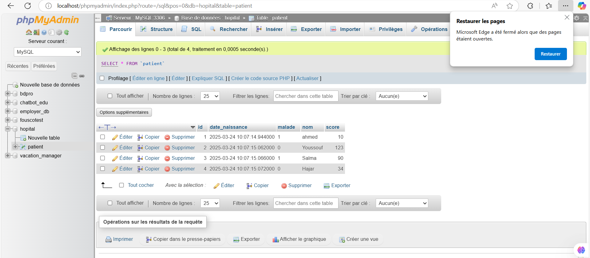

# 🏥 Gestion des Patients avec Spring Boot

## 📌 Description
Ce projet est une **application web JEE** basée sur **Spring Boot**, **Spring MVC**, **Thymeleaf** et **Spring Data JPA**. Elle permet de **gérer les patients** avec différentes fonctionnalités, telles que la pagination, la recherche et la suppression.

Le projet est développé en plusieurs **parties** :
1. **Partie 1** : Gestion des patients (CRUD, pagination, recherche, suppression).
2. **Partie 2** : Ajout d'un **template Thymeleaf** et validation des formulaires.
3. **Partie 3** : Sécurisation avec **Spring Security** (InMemory, JDBC, UserDetailsService).

---

## 🛠 Technologies utilisées
- **Spring Boot 3.2** (Framework principal)
- **Spring Data JPA** (Gestion de la base de données)
- **Spring MVC** (Gestion des requêtes et vues)
- **Thymeleaf** (Moteur de templates pour le frontend)
- **Bootstrap 5.1.1** (Design responsive)
- **Spring Security** (Sécurisation des accès)
- **H2 / MySQL** (Base de données)

---

## 🚀 Installation et Exécution

### 1️⃣ Cloner le projet
```bash
git clone https://github.com/YoussoufHard/spring-mvc-gestion-patients.git
cd spring-mvc-gestion-patients
```

### 2️⃣ Configuration de la base de données
Dans **`application.properties`**, sélectionner H2 ou MySQL :
```properties
# H2 (mode mémoire)
spring.datasource.url=jdbc:h2:mem:patients_db
spring.datasource.driverClassName=org.h2.Driver
spring.datasource.username=sa
spring.datasource.password=
spring.h2.console.enabled=true

# MySQL (décommenter si nécessaire)
# spring.datasource.url=jdbc:mysql://localhost:3306/patients_db
# spring.datasource.username=root
# spring.datasource.password=ton_mdp
# spring.jpa.hibernate.ddl-auto=update
```
Capture de la base de données creer dans mysql apres l'execution

 

### 3️⃣ Lancer l’application
```bash
mvn spring-boot:run
```
Ou dans **IntelliJ**, exécuter la classe `HopitalApplication`.

### 4️⃣ Accéder à l’application
🌍 **URL principale** : `http://localhost:8080/`  
🛠 **Console H2** : `http://localhost:8080/h2-console`

---

## 📂 Structure du projet
```
📦 ma.enset.hopital
 ┣ 📂 entities
 ┃ ┗ 📜 Patient.java
 ┣ 📂 repository
 ┃ ┗ 📜 PatientRepository.java
 ┣ 📂 web
 ┃ ┗ 📜 PatientController.java
 ┣ 📂 security
 ┃ ┗ 📜 SecurityConfig.java
 ┗ 📜 HopitalApplication.java
```

---

## 📜 Fonctionnalités

### ✅ Partie 1 : Gestion des patients
📄 **Afficher les patients**  
🔍 **Rechercher un patient par nom**  
❌ **Supprimer un patient**  
📑 **Pagination des résultats**

🌍 **URL :** `http://localhost:8080/index`

📌 Tutoriel : [📹 Partie 1](https://www.youtube.com/watch?v=jDm-q-jEbiA)

## Aperçu de l'interface
Voici un aperçu de la page d'accueil du système avant pagination:

 

Voici un aperçu de la page d'accueil du système après pagination :


Voici un aperçu de la page d'accueil du système avec l'option de Recherche:


Voici un aperçu du systeme avec bare recherche et iconne 


Aperçu de la supression 


Aperçu de la modification d'un patient avec les données prérempli


---

### 🎨 Partie 2 : Templates et validation
 **Ajout d'un design Bootstrap pour rendre l'interface plus conviviale**  
 **Validation des formulaires avec Spring Boot**       
Voici la capture de la partie le template + validation (ici, je prends exemple de la page d'ajout, c'est de même pour la )


Nb: J'utilise le meme formulaire pour l'ajout et la modification pour l'optimisation du code.  
📌 Tutoriel : [📹 Partie 2](https://www.youtube.com/watch?v=eoBE745lDE0)

---

### 🔒 Partie 3 : Sécurité avec Spring Security
### 1️⃣ **InMemory Authentication** ([📹 Tutoriel](https://www.youtube.com/watch?v=7VqpC8UD1zM))  

#### Objectif:

L'objectif de cette partie est d'implémenter la sécurité dans une application web en utilisant **Spring Security**, avec une **authentification en mémoire (InMemory Authentication)** et une gestion des accès en fonction des rôles des utilisateurs.

 Explication

- Nous avons créé des utilisateurs en mémoire avec des mots de passe encodés.
- Les utilisateurs peuvent être assignés à des rôles comme `USER` ou `ADMIN`, et l'accès aux pages est contrôlé en fonction de ces rôles.

#### Configuration des utilisateurs

```java
@Bean
public InMemoryUserDetailsManager inMemoryUserDetailsManager(PasswordEncoder passwordEncoder) {
    String encodedPassword = passwordEncoder.encode("1234");

    UserDetails user1 = User.withUsername("user1").password(encodedPassword).roles("USER").build();
    UserDetails user2 = User.withUsername("user2").password(encodedPassword).roles("USER").build();
    UserDetails admin = User.withUsername("admin").password(encodedPassword).roles("USER", "ADMIN").build();

    return new InMemoryUserDetailsManager(user1, user2, admin);
}
```

### Pages de l'application

#### Page de Login Personnalisée

Voici la page de login personnalisée avec un formulaire permettant aux utilisateurs de se connecter.


#### Liste des patients en tant qu'Admin

Quand un utilisateur avec le rôle **ADMIN** se connecte, il peut accéder à la liste complète des patients et effectuer des opérations de gestion.


#### Liste des patients en tant qu'Utilisateur Standard (USER)

Quand un utilisateur avec le rôle **USER** se connecte, il peut consulter la liste des patients, mais avec des options limitées, sans pouvoir supprimer ou éditer des informations.


#### Page d'Erreur pour un Utilisateur Non Autorisé

Quand un utilisateur tente d'accéder à une page ou une fonctionnalité qui nécessite des privilèges plus élevés (comme supprimer ou éditer un patient), il est redirigé vers une page d'erreur, indiquant qu'il n'a pas les permissions nécessaires.


### 2️⃣ **JDBC Authentication** ([📹 Tutoriel](https://www.youtube.com/watch?v=Haz3wLiQ5-0))

Dans cette partie, nous utilisons **Spring Security avec JDBC Authentication** pour enregistrer automatiquement des utilisateurs dans la base de données au démarrage de l’application.

####  Objectif

Ajouter des utilisateurs dans la table `users` et leur associer des rôles via la table `authorities`.

#### ⚙️ Implémentation

```java
@Bean
CommandLineRunner commandLineRunner(JdbcUserDetailsManager jdbcUserDetailsManager) {
    PasswordEncoder passwordEncoder = passwordEncoder();
    return args -> {
        jdbcUserDetailsManager.createUser(
            User.withUsername("user11")
                .password(passwordEncoder.encode("1234"))
                .roles("USER")
                .build()
        );
        jdbcUserDetailsManager.createUser(
            User.withUsername("user22")
                .password(passwordEncoder.encode("1234"))
                .roles("USER")
                .build()
        );
        jdbcUserDetailsManager.createUser(
            User.withUsername("admin2")
                .password(passwordEncoder.encode("1234"))
                .roles("USER", "ADMIN")
                .build()
        );
    };
}
```

#### 🔐 Encoder le mot de passe

```java
@Bean
PasswordEncoder passwordEncoder() {
    return new BCryptPasswordEncoder();
}
```

#### 🧪 Résultat

Après démarrage, les utilisateurs sont ajoutés dans les tables `users` et `authorities` automatiquement.

voici la capture du bd


voici la capture de la connexion avec les users de la base de donnée


### 3️⃣ **UserDetailsService** ([📹 Tutoriel](https://www.youtube.com/watch?v=RTiS9ygyYs4))


---

## 📑 Auteur
👨‍💻 **TANGARA YOUSSOUF** - *Projet réalisé dans le cadre du TP Spring Boot*   

---

  **Encadré par** : **Prof. Mohamed Youssfi**


---

💡 **Le projet sera amélioré progressivement avec les nouvelles fonctionnalités.**
